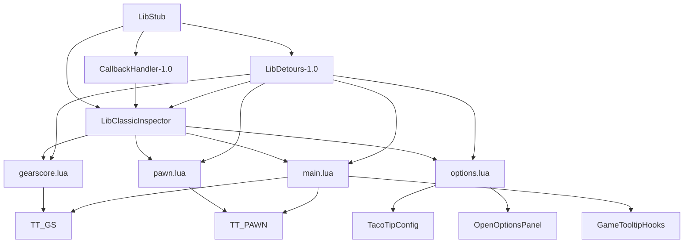

# System Patterns

## Module split

- `main.lua`: runtime bootstrap, tooltip hooks, refresh callbacks, mover and anchoring logic, and item tooltip handling.
- `options.lua`: defaults, config bootstrap, settings panel, UI controls, and preview tooltip rendering.
- `gearscore.lua`: GearScore and item-level calculations plus item quality coloring.
- `pawn.lua`: optional Pawn integration and score lookup logic.
- `Locale/*.lua`: localized strings and labels.
- `Libs/*`: bundled support libraries and inspection engine.

## Runtime patterns

- Client gate: `GetBuildInfo()` major-version check; return early outside Classic families.
- Library gate: assert required libs before continuing.
- Shared globals: `TT`, `TT_GS`, `TT_PAWN`, `TacoTipConfig`, `TACOTIP_LOCALE`.
- Tooltip hooks: `GameTooltip:HookScript("OnTooltipSetUnit")`, `GameTooltip:HookScript("OnTooltipSetItem")`, plus Shopping and ItemRef tooltip hooks.
- Anchor override: `hooksecurefunc("GameTooltip_SetDefaultAnchor", ...)`.
- Late-refresh pattern: repaint after cached item data or Pawn data becomes available.
- Slash command bootstrap: `gearscore.lua` seeds the shared `/tacotip` handler early; later modules respect the existing `SlashCmdList.TACOTIP` guard.

## Wiring map

## Design notes to preserve

- `TacoTip.toc` must keep the library load order before the feature modules.
- The addon’s runtime depends on globals created by earlier files; changing order can break startup.
- Optional Pawn support should stay conditional rather than becoming a hard requirement.
- Tooltip layout behavior depends on config flags such as `tip_style`, `show_target`, `show_gs_player`, `show_pawn_player`, and the anchor settings.
