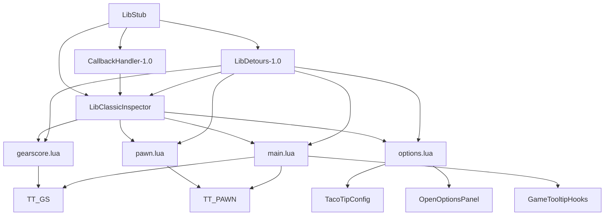

# System Patterns

## Module split

- `main.lua`: runtime bootstrap, tooltip hooks, refresh callbacks, mover and anchoring logic, and item tooltip handling.
- `options.lua`: defaults, config bootstrap, settings panel, and UI controls.
- `gearscore.lua`: GearScore and item-level calculations plus item quality coloring.
- `pawn.lua`: optional Pawn integration and score lookup logic.
- `Locale/*.lua`: localized strings and labels.
- `Libs/*`: bundled support libraries and inspection engine.

## Runtime patterns

- Client gate: `GetBuildInfo()` major-version check; return early outside Classic families.
- Library gate: assert required libs before continuing.
- Shared globals: `TT`, `TT_GS`, `TT_PAWN`, `TacoTipConfig`, `TACOTIP_LOCALE`.
- Tooltip hooks: `GameTooltip:HookScript("OnTooltipSetUnit")`, `GameTooltip:HookScript("OnTooltipSetItem")`, plus Shopping and ItemRef tooltip hooks.
- Anchor override: `hooksecurefunc("GameTooltip_SetDefaultAnchor", ...)`.
- Late-refresh pattern: repaint after cached item data or Pawn data becomes available.
- Slash command bootstrap: `gearscore.lua` seeds the shared `/tacotip` handler early; later modules respect the existing `SlashCmdList.TACOTIP` guard.
- **Backdrop child-frame overlay (runtime NineSlice detection):** Modern tooltip templates attach a NineSlicePanel child frame for their backdrop; this is verified present on Classic Era, TBC Anniversary, AND Wrath (era `SharedTooltipTemplates.xml` ships it), so the branch is detected at runtime via `tooltip.NineSlice`, not by client build number. Direct `SetBackdrop`/`SetBackdropBorderColor` on the tooltip parent has no visual effect when NineSlice renders the backdrop. The pattern is `getOrCreateBackdropFrame` in `main.lua`, which creates a separate `BackdropTemplate` child frame at `FrameLevel(2)` (above NineSlice, below text content). NineSlice stays visible for the default background; the overlay draws only the colored border edge via `SetBackdrop({edgeFile = ...})` + `SetBackdropBorderColor`. Border thickness is configurable via `TacoTipConfig.tooltip_border_edge_size` (default 14, range 4–48). Tooltips without a NineSlice child fall back to the original full-backdrop path unchanged.
- **`safeCall` error capture:** All GameTooltip script hooks, event handlers, and callback shims are wrapped in `xpcall(..., geterrorhandler(), ...)` so errors flow through Blizzard's error handler to BugSack/!Swatter instead of silently breaking tooltips.
- **Zero-allocation hover table pooling:** Unit mouseover line aggregation uses pre-allocated static pooled buffers (`pooledLinesToAdd`, `pooledTooltipText` in `main.lua`) and direct scalar argument forwarding in `gearscore.lua`, eliminating garbage collector churn on fast mouse sweeps.
- **SharedMedia resolution cache:** `TT:GetResolvedTooltip*` in `options.lua` caches resolved media paths and keys. Lookups are $O(1)$ and only invalidated (`TT:InvalidateResolvedMediaCache`) when configuration changes or `LibSharedMedia_Registered` fires.
- **Lifecycle & Event Gating:** Unit-specific events like `UNIT_POWER_UPDATE` on `TacoTipPowerBar` and `UNIT_TARGET` in `main.lua` are gated behind `IsShown()` checks and unregistered when idle, eliminating event processing overhead during combat.
- **Throttled 3D Model Sync:** The 3D portrait model frame's `OnUpdate` alpha synchronization is throttled to 20Hz (0.05s) to avoid querying model and frame alpha on every single engine render frame.

## Wiring map

```mermaid
graph TD
 LibStub --> CallbackHandler[CallbackHandler-1.0]
 LibStub --> LibDetours[LibDetours-1.0]
 LibStub --> LCI[LibClassicInspector]
 CallbackHandler --> LCI
 LibDetours --> LCI

 LCI --> GearScore[gearscore.lua]
 LCI --> Pawn[pawn.lua]
 LCI --> Options[options.lua]
 LCI --> Main[main.lua]

 LibDetours --> GearScore
 LibDetours --> Pawn
 LibDetours --> Options
 LibDetours --> Main

 GearScore --> TT_GS
 Pawn --> TT_PAWN
 Options --> TacoTipConfig
 Options --> OpenOptionsPanel
 Main --> GameTooltipHooks
 Main --> TT_GS
 Main --> TT_PAWN
```

## Design notes to preserve

- `TacoTip.toc` must keep the library load order before the feature modules.
- The addon’s runtime depends on globals created by earlier files; changing order can break startup.
- Optional Pawn support should stay conditional rather than becoming a hard requirement.
- Tooltip layout behavior depends on config flags such as `tip_style`, `show_target`, `show_gs_player`, `show_pawn_player`, and the anchor settings.

## Universal inspection scheduling

`LibForeverInspector` keeps one active background request and a bounded GUID queue. Its scheduler observes all `NotifyInspect` calls, checks interaction distance before background inspect APIs, yields to manual inspection, defers unavailable players for up to 15 seconds without blocking others, and refreshes inventory separately from talents. See `TacoTip_Forever/README.md#inspection-scheduling`.
