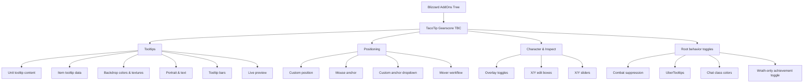
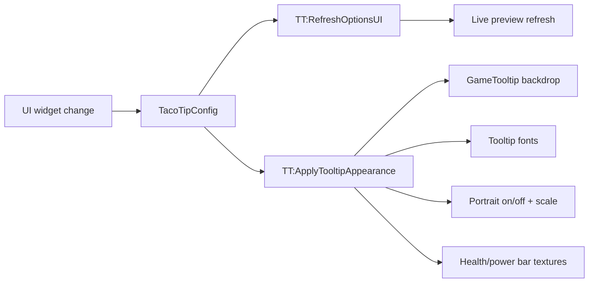

# Visualization Context — TacoTip Gearscore TBC UI

## Last updated

- 2026-06-01

This file is the durable UI snapshot for future sessions.
It records how the professional Blizzard options UI is intended to look, how the pages are grouped, and where the current polish targets live.

## Canonical addon identity

- **Published addon name:** `TacoTip Gearscore TBC`
- **Folder / Lua global name:** `TacoTip`
- **Blizzard AddOns tree entry:** should appear as `TacoTip Gearscore TBC`

## AddOns tree structure

```ascii
Blizzard Options
└── AddOns
    └── TacoTip Gearscore TBC
        ├── Tooltips
        ├── Positioning
    └── Character & Inspect
```

## Root page intent

```ascii
+---------------------------------------------------------------------+
| TacoTip Gearscore TBC v0.5.1                                        |
| Better player tooltips with GearScore, talents, positioning, and UI |
| polish for Classic-era clients.                                     |
|                                                                     |
| Quick Actions                                                       |
| [ Open Tooltip Mover ] [ Reset configuration ]                      |
|                                                                     |
| • Current tooltip mode summary                                      |
| • Current addon language summary                                    |
| • Character/inspect overlay summary                                 |
| • Reminder to use the child pages in the AddOns tree                |
|                                                                     |
| Addon language                                                      |
| [ Client default (English) ▼ ]                                      |
| Reload UI after changing the saved addon language.                  |
|                                                                     |
| Behavior & client settings                                          |
| [x] Suppress inspection details in combat                           |
| [x] Enhanced Tooltips           [x] Chat Class Colors               |
| [ ] Show Achievement Points (Wrath only)                            |
+---------------------------------------------------------------------+
```

## Tooltips page — intended visual structure

```ascii
+----------------------------------------------------------------------------------+
| Tooltips                                                                         |
| Tune the extra data TacoTip adds to tooltips.                                    |
|                                                      [ Live Preview ]             |
| Tooltip Style                                                                    |
| [ FULL / COMPACT / MINI ▼ ]                             [ sample tooltip ]        |
|                                                         [ hp/power bars ]         |
| Unit tooltip content                                                              |
| [x] Class Color                  [x] Title                                        |
| [x] Guild Name                   [x] Guild Rank                                   |
| Style                                                                            |
| [ Rank of <Guild> ▼ ]                                                            |
| [x] Talents                      [x] Target                                       |
| [x] Show player GearScore        [x] Show Pawn scores                            |
| [x] Faction Icon                 [x] PvP Icon                                     |
| [x] Health Bar                   [x] Power Bar                                    |
|                                                                                  |
| Item tooltip data                                                                |
| [x] Show Item Level              [x] Show Item GearScore                         |
| [x] HunterScore                                                                 |
|                                                                                  |
| Visual style                                                                     |
| Backdrop colors & textures                                                       |
| [x] Use class-colored border    [x] Use class-colored background tint            |
| Border color                     Background color                                |
| [ Choose color ][■■■]            [ Choose color ][■■■]                           |
| Border alpha                     Background alpha                                |
| [------O------] 75               [------O------] 85                              |
| Tooltip background texture                                                     |
| [██████████████████ Blizzard - Tooltip Background ▼ ]                            |
| Tooltip border texture                                                         |
| [██████████████████ Blizzard - Tooltip Border ▼ ]                                |
|                                                                                  |
| Portrait & text                                                                  |
| [x] Show unit portrait                                                           |
| Portrait scale                                                                   |
| [------O------] 100                                                              |
| Tooltip font                                                                     |
| [ Friz Quadrata TT ▼ ]                                                           |
| Tooltip text size                                                                |
| [------O------] 12                                                               |
|                                                                                  |
| Tooltip bars                                                                     |
| Health & power bar texture                                                       |
| [██████████████████ Blizzard - Status Bar ▼ ]                                    |
+----------------------------------------------------------------------------------+
```

## Positioning page — intended visual structure

```ascii
+---------------------------------------------------------------------+
| Positioning                                                          |
| Choose tooltip placement and mover behavior.                         |
|                                                                     |
| Tooltip position mode                                               |
| [x] Custom Tooltip Position      [ ] Anchor to Mouse                |
| [x] Only in WorldFrame           [ ] Anchor Spells to Mouse         |
| Custom tooltip anchor                                               |
| [ Top Left ▼ ]                 [ Open Tooltip Mover ]               |
|                                                                     |
| Tooltip behavior                                                   |
| [x] Instant Fade                                                   |
+---------------------------------------------------------------------+
```

## Character & Inspect page — intended visual structure

```ascii
+---------------------------------------------------------------------+
| Character & Inspect                                                  |
| Overlay toggles plus precise X/Y tuning.                             |
|                                                                     |
| [x] Show GearScore overlays    [x] Show average item level overlays |
| [ ] Enable manual overlay movers                                    |
|                                                                     |
| Character GearScore offsets                                          |
| X [  0 ]  [-----O-----] 0                                            |
| Y [  0 ]  [-----O-----] 0                                            |
|                                                                     |
| Character iLvl offsets                                               |
| X [  0 ]  [-----O-----] 0                                            |
| Y [  0 ]  [-----O-----] 0                                            |
|                                                                     |
| Inspect GearScore offsets                                            |
| X [  0 ]  [-----O-----] 0                                            |
| Y [  0 ]  [-----O-----] 0                                            |
|                                                                     |
| Inspect iLvl offsets                                                 |
| X [  0 ]  [-----O-----] 0                                            |
| Y [  0 ]  [-----O-----] 0                                            |
+---------------------------------------------------------------------+
```

## Interaction map



## Appearance data flow



## Current professional-quality checklist

- Keep **single dropdowns** for media selection; do not regress to nested menus.
- Keep **wide texture strip previews** visible in the dropdown list and selected value.
- Keep **titles above controls** for all dropdowns, sliders, and swatch pickers.
- Keep **hover descriptions** on custom widgets and high-value labels.
- Keep **mouse-wheel support** on scrollable pages and slider widgets.
- Keep **Blizzard defaults** available even when no SharedMedia pack is installed.
- Keep **Merfin Plus / SharedMedia** pickup automatic through `LibSharedMedia-3.0` registration.
- Keep the live preview reflecting tooltip appearance changes immediately.

## Known approximation notes

- ASCII blocks above are intent diagrams, not pixel-perfect screenshots.
- The actual Blizzard templates will vary slightly by Classic client skin, font rendering, and scrollbar width.
- The dropdown preview cannot literally paint a texture behind text like a custom owner-drawn list; the current design approximates this with a wide texture strip plus the media name inside the same single dropdown item.
